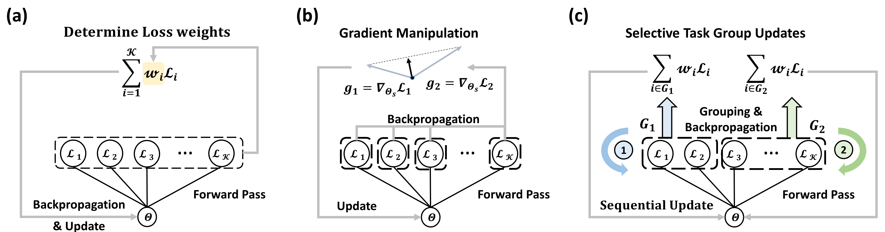

# Selective Task Group Updates for Multi-Task Optimization [ICLR 2025]

**Official PyTorch implementation of [*Selective Task Group Updates for Multi-Task Optimization*](https://arxiv.org/abs/2502.11986) [ICLR 2025].**

Wooseong Jeong & Kuk-Jin Yoon, Korea Advanced Institute of Science and Technology (KAIST)

 

Multi-task learning enables the acquisition of task-generic knowledge by training
multiple tasks within a unified architecture. However, training all tasks together
in a single architecture can lead to performance degradation, known as negative
transfer, which is a main concern in multi-task learning. Previous works have
addressed this issue by optimizing the multi-task network through gradient manipulation or weighted loss adjustments. However, their optimization strategy
focuses on addressing task imbalance in shared parameters, neglecting the learning of task-specific parameters. As a result, they show limitations in mitigating
negative transfer, since the learning of shared space and task-specific information
influences each other during optimization. To address this, we propose a different
approach to enhance multi-task performance by selectively grouping tasks and
updating them for each batch during optimization. We introduce an algorithm that
adaptively determines how to effectively group tasks and update them during the
learning process. To track inter-task relations and optimize multi-task networks
simultaneously, we propose proximal inter-task affinity, which can be measured
during the optimization process. We provide a theoretical analysis on how dividing
tasks into multiple groups and updating them sequentially significantly affects
multi-task performance by enhancing the learning of task-specific parameters. Our
methods substantially outperform previous multi-task optimization approaches and
are scalable to different architectures and various numbers of tasks.


## 1. Dataset
We use the same datasets as [InvPT](https://github.com/prismformore/Multi-Task-Transformer/tree/main/InvPT): **NYUD-v2** and **PASCAL-Context**.

You can download them from the following links:

- [NYUDv2.tar.gz](https://hkustconnect-my.sharepoint.com/:u:/g/personal/hyeae_connect_ust_hk/EZ-2tWIDYSFKk7SCcHRimskBhgecungms4WFa_L-255GrQ?e=6jAt4c)  
- [PASCALContext.tar.gz](https://hkustconnect-my.sharepoint.com/:u:/g/personal/hyeae_connect_ust_hk/ER57KyZdEdxPtgMCai7ioV0BXCmAhYzwFftCwkTiMmuM7w?e=2Ex4ab)

After downloading, extract the datasets using:

```bash
tar xfvz NYUDv2.tar.gz
tar xfvz PASCALContext.tar.gz
```

## 2. Dataset Path Configuration
To train or evaluate models, you must set the dataset locations in the path configuration file.

This file contains hardcoded paths to each dataset. 
Only modify the two variables below:

```python
# === MODIFY ONLY THESE VARIABLES ===
db_root = '/path/to/NYUD_or_PASCAL'          # e.g., '/home/user/datasets/NYUDv2'
db_root_taskonomy = '/path/to/Taskonomy'     # e.g., '/home/user/datasets/Taskonomy'
# ====================================
```

## 3. Build environment
```bash
conda env create -f environment.yml
conda activate sel-mtl
```


## 4. Train and Evaluate
```bash
cd sel-update-mtl
bash run.sh
```


## Acknowledgements
This repository incorporates experimental settings and codes from the following prior works:

- **[InvPT: Inverted Pyramid Multi-task Transformer for Dense Scene Understanding](https://arxiv.org/abs/2203.07997)**  
  by Hanrong Ye and Dan Xu, *ECCV 2022*  
  GitHub: [https://github.com/prismformore/Multi-Task-Transformer](https://github.com/prismformore/Multi-Task-Transformer)

- **[MTI-Net: Multi-Scale Task Interaction Networks for Multi-Task Learning](https://arxiv.org/abs/2001.06902)**  
  by Simon Vandenhende, Stamatios Georgoulis, and Luc Van Gool, *ECCV 2020*  
  GitHub: [https://github.com/SimonVandenhende/Multi-Task-Learning-PyTorch](https://github.com/SimonVandenhende/Multi-Task-Learning-PyTorch)

> We sincerely thank the authors for open-sourcing their codebases. 


## Contact
Wooseong Jeong: stk14570@kaist.ac.kr

## Citation
If you use this work in your research, please cite it as:

```bibtex
@article{jeong2025selective,
  title   = {Selective Task Group Updates for Multi-Task Optimization},
  author  = {Jeong, Wooseong and Yoon, Kuk-Jin},
  journal = {arXiv preprint arXiv:2502.11986},
  year    = {2025}
}


